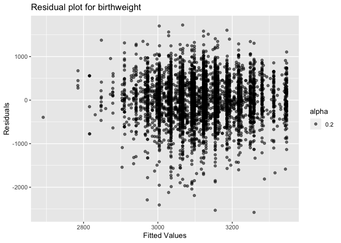
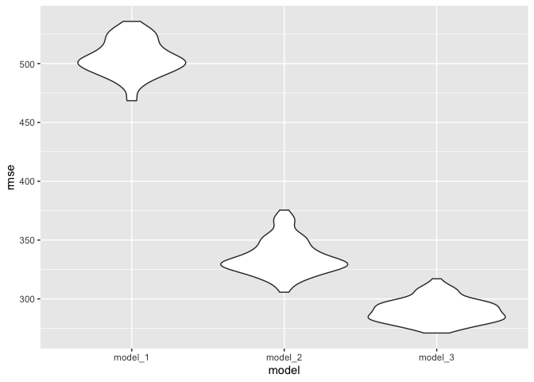
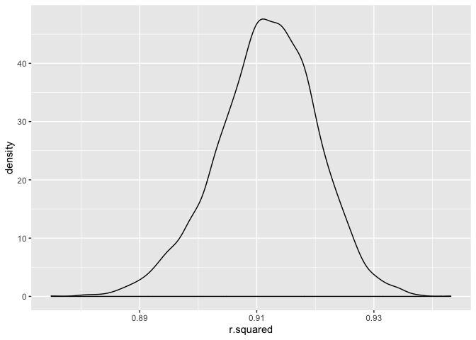
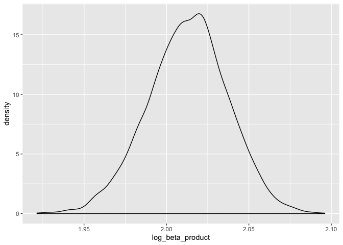

p8105\_hw6\_sl4655
================
Shuya Liu
November 24, 2019

Problem 1
---------

#### Load and clean the data

``` r
df_children <- read_csv('./Data/birthweight.csv') %>% 
  janitor::clean_names() %>%
  mutate(babysex = factor(babysex, levels = c(1, 2), labels = c("male", "female")),
         frace = factor(frace, levels = c(1, 2, 3, 4, 8, 9), labels = c("White", "Black", "Asian", "Puerto Rican", "Other", "Unknown")),
         malform = factor(malform, levels = c(0, 1), labels = c("absent", "present")),
         mrace = factor(mrace, levels = c(1, 2, 3, 4, 8), labels = c("White", "Black", "Asian", "Puerto Rican", "Other")))
```

    ## Parsed with column specification:
    ## cols(
    ##   .default = col_double()
    ## )

    ## See spec(...) for full column specifications.

``` r
skimr::skim(df_children)
```

    ## Skim summary statistics
    ##  n obs: 4342 
    ##  n variables: 20 
    ## 
    ## ── Variable type:factor ─────────────────────────────────────────────────────────────────────────────────────────────────
    ##  variable missing complete    n n_unique
    ##   babysex       0     4342 4342        2
    ##     frace       0     4342 4342        5
    ##   malform       0     4342 4342        2
    ##     mrace       0     4342 4342        4
    ##                               top_counts ordered
    ##              mal: 2230, fem: 2112, NA: 0   FALSE
    ##  Whi: 2123, Bla: 1911, Pue: 248, Asi: 46   FALSE
    ##                abs: 4327, pre: 15, NA: 0   FALSE
    ##  Whi: 2147, Bla: 1909, Pue: 243, Asi: 43   FALSE
    ## 
    ## ── Variable type:numeric ────────────────────────────────────────────────────────────────────────────────────────────────
    ##  variable missing complete    n      mean     sd     p0     p25     p50
    ##     bhead       0     4342 4342   33.65     1.62  21      33      34   
    ##   blength       0     4342 4342   49.75     2.72  20      48      50   
    ##       bwt       0     4342 4342 3114.4    512.15 595    2807    3132.5 
    ##     delwt       0     4342 4342  145.57    22.21  86     131     143   
    ##   fincome       0     4342 4342   44.11    25.98   0      25      35   
    ##   gaweeks       0     4342 4342   39.43     3.15  17.7    38.3    39.9 
    ##  menarche       0     4342 4342   12.51     1.48   0      12      12   
    ##   mheight       0     4342 4342   63.49     2.66  48      62      63   
    ##    momage       0     4342 4342   20.3      3.88  12      18      20   
    ##    parity       0     4342 4342    0.0023   0.1    0       0       0   
    ##   pnumlbw       0     4342 4342    0        0      0       0       0   
    ##   pnumsga       0     4342 4342    0        0      0       0       0   
    ##     ppbmi       0     4342 4342   21.57     3.18  13.07   19.53   21.03
    ##      ppwt       0     4342 4342  123.49    20.16  70     110     120   
    ##    smoken       0     4342 4342    4.15     7.41   0       0       0   
    ##    wtgain       0     4342 4342   22.08    10.94 -46      15      22   
    ##      p75   p100     hist
    ##    35      41   ▁▁▁▁▅▇▁▁
    ##    51      63   ▁▁▁▁▁▇▁▁
    ##  3459    4791   ▁▁▁▃▇▇▂▁
    ##   157     334   ▁▇▅▁▁▁▁▁
    ##    65      96   ▁▂▇▂▂▂▁▃
    ##    41.1    51.3 ▁▁▁▁▃▇▁▁
    ##    13      19   ▁▁▁▁▂▇▁▁
    ##    65      77   ▁▁▁▅▇▂▁▁
    ##    22      44   ▂▇▅▂▁▁▁▁
    ##     0       6   ▇▁▁▁▁▁▁▁
    ##     0       0   ▁▁▁▇▁▁▁▁
    ##     0       0   ▁▁▁▇▁▁▁▁
    ##    22.91   46.1 ▁▇▅▁▁▁▁▁
    ##   134     287   ▁▇▆▁▁▁▁▁
    ##     5      60   ▇▁▁▁▁▁▁▁
    ##    28      89   ▁▁▁▇▇▁▁▁

#### Propose a regression model for birthweight

First, we consider that a child's birthweight is based on its gender, the family income, and the number of cigaretts smoke. This model is based on a hypothesized structure for the factors that underly birthweight that the nutrition that a baby gets during the pregnancy is represented by the family income and the number of cigaretts smoked during pregnancy, and we would expect different birthweight in different sex.

``` r
reg_mod_1 <- lm(bwt ~ babysex + fincome + smoken, data = df_children)

df_children %>%
  modelr::add_predictions(reg_mod_1) %>% 
  modelr::add_residuals(reg_mod_1) %>% 
  ggplot(aes(x = pred, y = resid)) +
  geom_point(aes(alpha = .2)) +
  ggtitle('Residual plot for birthweight') +
  labs(
    x = "Fitted Values",
    y = "Residuals"
  )
```



The plot of model residuals against fitted values shows that the error terms are residual values bounce around 0. Residuals form a horizontal ‘band’ around zero: above and below, which indicates the equal variance. However, there are some ‘unusual’ values stand out from the random pattern on the left, which is an indication of potential outliers in the lower range of birthweight.

#### Comparing models

``` r
reg_mod_2 <- lm(bwt ~ blength + gaweeks, data = df_children)
reg_mod_3 <- lm(bwt ~ blength * bhead * babysex, data = df_children)

df_children %>% 
  crossv_mc(100) %>% 
  mutate(train = map(train, as.tibble),
         test = map(test, as.tibble)) %>% 
  mutate(mod1_pred = map(train, ~lm(bwt ~ babysex + fincome + smoken, data = .x)),
         mod2_pred = map(train, ~lm(bwt ~ blength + gaweeks, data = .x)),
         mod3_pred = map(train, ~lm(bwt ~ blength * bhead * babysex, data=.x))) %>% 
  mutate(rmse_model_1 = map2_dbl(mod1_pred, test, ~rmse(model = .x, data =.y)),
         rmse_model_2 = map2_dbl(mod2_pred, test, ~rmse(model = .x, data =.y)),
         rmse_model_3 = map2_dbl(mod3_pred, test, ~rmse(model = .x, data =.y))) %>% 
  select(starts_with("rmse")) %>% 
  gather(key = model, value = rmse) %>% 
  mutate(model = str_replace(model, "rmse_", ""),
         model = fct_inorder(model)) %>% 
  ggplot(aes(x = model, y = rmse)) + geom_violin()
```



In this plot, we can observe that the model\_3 has a much lower rmse that the other two, so model\_3 is might be a better model compared to the other two.

Problem 2
---------

#### Data download

``` r
weather_df = 
  rnoaa::meteo_pull_monitors(
    c("USW00094728"),
    var = c("PRCP", "TMIN", "TMAX"), 
    date_min = "2017-01-01",
    date_max = "2017-12-31") %>%
  mutate(
    name = recode(id, USW00094728 = "CentralPark_NY"),
    tmin = tmin / 10,
    tmax = tmax / 10) %>%
  select(name, id, everything())
```

    ## Registered S3 method overwritten by 'crul':
    ##   method                 from
    ##   as.character.form_file httr

    ## Registered S3 method overwritten by 'hoardr':
    ##   method           from
    ##   print.cache_info httr

    ## file path:          /Users/lsyjessica/Library/Caches/rnoaa/ghcnd/USW00094728.dly

    ## file last updated:  2019-10-12 15:25:16

    ## file min/max dates: 1869-01-01 / 2019-10-31

#### 5000 bootstrap samples

``` r
results = 
  weather_df %>% 
  select(tmin, tmax) %>% 
  modelr::bootstrap(n = 5000) %>% 
  mutate(
    models = map(strap, ~ lm(tmax ~ tmin, data = .x)),
    results_r = map(models, broom::glance),
    results_beta = map(models, broom::tidy)) %>% 
  select(.id, results_r, results_beta)
```

#### Plot the distributions

``` r
results %>% 
  select(results_r) %>% 
  unnest(results_r) %>% 
  select(r.squared) %>% 
  ggplot(aes(x = r.squared)) + geom_density()
```

 The distribution of r squared is nearly bell-shaped and approximately normal, with a little skewness to the left.

``` r
results %>% 
  select(.id, results_beta) %>% 
  unnest(results_beta) %>% 
  select(.id, term, estimate) %>% 
  pivot_wider(id_cols = .id, names_from = term, values_from = estimate) %>% 
  rename(intercept = "(Intercept)") %>% 
  mutate(log_beta_product = log(intercept * tmin)) %>% 
  select(log_beta_product) %>% 
  ggplot(aes(x = log_beta_product)) + geom_density()
```



The distribution of log (beta0 \* beta1) is nearly bell-shaped and approximately normal, with a little skewness to the left.

#### 95% Confidence Interval

``` r
## 95% confidence interval for r^2
results %>% 
  select(results_r) %>% 
  unnest(results_r) %>% 
  select(r.squared) %>% 
  summarise("2.5%" = quantile(r.squared,0.025), "97.5% " = quantile(r.squared,0.975)) %>% 
  round(3) %>%
  knitr::kable(caption = "95% confidence interval for r_squared" ) 
```

|   2.5%| 97.5% |
|------:|:-----:|
|  0.893| 0.927 |

``` r
## 95% confidence interval for log(beta0*beta1)
results %>% 
  select(.id, results_beta) %>% 
  unnest(results_beta) %>% 
  select(.id, term, estimate) %>% 
  pivot_wider(id_cols = .id, names_from = term, values_from = estimate) %>% 
  rename(intercept = "(Intercept)") %>% 
  mutate(log_beta_product = log(intercept * tmin)) %>% 
  select(log_beta_product) %>% 
  summarise("2.5%" = quantile(log_beta_product, 0.025), "97.5% " = quantile(log_beta_product, 0.975)) %>% 
  knitr::kable(caption = "95% confidence interval for log(beta0*beta1)" )
```

|      2.5%|   97.5%  |
|---------:|:--------:|
|  1.963604| 2.058751 |
